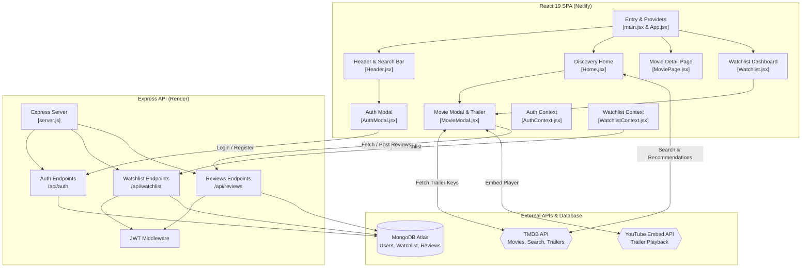

# 🎬 CineVault — Full-Stack Movie Discovery & Streaming App

<div align="center">


[](https://vault-cine.netlify.app)
[](https://github.com/Ritik639471/CineVault)

<br/>

[](https://react.dev/)
[](https://vitejs.dev/)
[](https://tailwindcss.com/)
[](https://www.framer.com/motion/)
[](https://firebase.google.com/)
[](https://nodejs.org/)
[](https://expressjs.com/)
[](https://www.mongodb.com/)
[](https://developer.themoviedb.org/)

**A cinematic, responsive web application engineered with React 19, Express, MongoDB Atlas, and TMDB API integration, featuring live trailers, watchlist curation, personalized recommendations, and community reviews.**

[Explore Live Demo](https://vault-cine.netlify.app) · [Report Bug](https://github.com/Ritik639471/CineVault/issues) · [Request Feature](https://github.com/Ritik639471/CineVault/issues)

</div>

---

## 📖 Table of Contents
- [Overview](#-overview)
- [Key Features](#-key-features)
- [System Architecture](#-system-architecture)
- [Tech Stack](#-tech-stack)
- [Directory Structure](#-directory-structure)
- [API Reference](#-api-reference)
- [Local Development Setup](#-local-development-setup)
- [Environment Variables](#-environment-variables)
- [Deployment Guide](#-deployment-guide)
- [Author & Acknowledgments](#-author--acknowledgments)

---

## 🌟 Overview

**CineVault** transforms the way cinema lovers discover and catalog movies. Powered by **The Movie Database (TMDB) API** and a custom **Node.js/Express** backend, the platform enables real-time search, multi-faceted filtering, high-definition trailer streaming inside modal overlays, personalized watchlist tracking with watched/unwatched toggles, and community reviews.

---

## ✨ Key Features

### 🔍 Dynamic Discovery & TMDB Search
- **Live Search with Debounce:** Instant search query matching against TMDB's movie index with responsive animated grid displays.
- **Trending & Popular Feeds:** Automated default curation displaying trending films when no search query is active.
- **Dedicated Movie Details Page (`/movie/:id`):** Deep dive into high-resolution movie backdrop, cast list, budget/revenue stats, runtime, and full plot summaries.

### 🎛️ Advanced Multi-Criteria Filtering
- **Sort Filters:** Filter results dynamically by *Most Popular*, *Top Rated*, or *Newest Releases*.
- **Genre Selection:** Real-time genre tagging (Action, Comedy, Drama, Sci-Fi, Horror, Thriller, etc.) matching official TMDB genre IDs.
- **Release Year Filtering:** Limit results to specific release windows (2020–2024+) with zero page reloads.

### 🎯 Personalized Recommendation Engine
- **Watchlist-Driven Recommendations:** When users log in and curate movies, the app identifies their latest saved film and automatically queries TMDB's `/movie/{id}/recommendations` endpoint to showcase a tailored *"Recommended For You"* ribbon.

### 🎥 Embedded YouTube Trailer Playback
- **In-Modal Streaming:** Queries TMDB `/videos` API to automatically retrieve official trailers and teasers.
- **Interactive Player:** One-click launch with a smooth glowing play icon that replaces the poster with an embedded YouTube `<iframe>` player.

### 💾 Personal Watchlist & Status Tracker
- **Status Lifecycle:** Mark films as **`plan_to_watch`** or **`watched`** with instant UI state reconciliation.
- **Cloud Synchronization:** Watchlist state is preserved in MongoDB Atlas, persisting across user devices and sessions.
- **One-Click Add/Remove:** Toggle saved state directly from movie cards or the detail view.

### ⭐ Community Reviews & Rating System
- **Upsert Rating Logic:** Authenticated users can leave 1–5 star ratings and written reviews; submitting an update automatically amends existing reviews without duplicating records.
- **Public Feed:** Community feedback is visible to all visitors in reverse chronological order.

### ✨ Modern Design & Fluid Motion
- **Glassmorphism Theme:** Dark-mode aesthetic accented with neon purple/magenta glows and frosted glass backdrops.
- **Framer Motion:** Staggered card reveals, springy modals, smooth page transitions, and interactive scale effects.

---

## 📐 System Architecture



---

## 🛠️ Tech Stack

### Frontend
- **Framework:** React 19 (`19.1.0`)
- **Build Tool:** Vite 7 (`7.0.4`)
- **Styling:** Tailwind CSS v4 (`4.2.2`)
- **Animation:** Framer Motion (`12.23.3`)
- **Routing:** React Router DOM v7 (`7.6.3`)
- **Authentication SDK:** Firebase (`11.10.0`) + Custom JWT integration
- **Deployment:** Netlify

### Backend
- **Framework:** Express.js (`4.21.1`) on Node.js
- **Database:** MongoDB Atlas + Mongoose (`8.8.4`)
- **Auth Security:** JSON Web Tokens (`jsonwebtoken` 9.0.2) + `bcryptjs` (2.4.3)
- **CORS & Config:** `cors` (2.8.5) + `dotenv` (16.4.5)
- **Deployment:** Render

### Third-Party Services
- **TMDB API:** Movie metadata, credits, release schedules, and video identifiers
- **YouTube IFrame API:** Responsive trailer streaming

---

## 📁 Directory Structure

```text
CineVault/
├── backend/
│   ├── models/
│   │   ├── Review.js          # Review schema (userId, movieId, rating, reviewText, userName)
│   │   ├── User.js            # User credentials & account details
│   │   └── Watchlist.js       # Watchlist items (userId, movieId, title, poster_path, status)
│   ├── .env                   # Server environment configurations
│   ├── server.js              # REST endpoints, auth middleware & DB connection
│   └── package.json
│
└── frontend/
    ├── public/
    │   └── _redirects         # Netlify SPA routing rules
    ├── src/
    │   ├── components/
    │   │   ├── AuthModal.jsx  # Sign in / Register modal dialog
    │   │   ├── Header.jsx     # Brand header, search input, genre filters, nav
    │   │   ├── MovieCard.jsx  # Poster display, rating badge, quick watchlist trigger
    │   │   ├── MovieModal.jsx # Detailed synopsis, YouTube trailer player, reviews
    │   │   └── Pagination.jsx # Page navigation controls
    │   ├── contexts/
    │   │   ├── AuthContext.jsx       # Global user token & session state
    │   │   └── WatchlistContext.jsx  # Global watchlist synchronized with backend
    │   ├── pages/
    │   │   ├── Home.jsx       # Trending feed, search results, recommendations
    │   │   ├── MoviePage.jsx  # Full-page movie metadata explorer
    │   │   └── Watchlist.jsx  # Categorized watchlist ("Plan to Watch" vs "Watched")
    │   ├── App.jsx            # Routing hierarchy & context providers
    │   ├── index.css          # Tailwind CSS v4 & custom scrollbar styles
    │   └── main.jsx           # Client root mounting
    ├── vite.config.js
    └── package.json
```

---

## 🔌 API Reference

### Authentication (`/api/auth`)
| Method | Endpoint | Description | Auth Required |
|:---|:---|:---|:---:|
| `POST` | `/api/auth/register` | Register user (`name`, `email`, `password`) | No |
| `POST` | `/api/auth/login` | Authenticate user & receive signed JWT | No |

### Watchlist (`/api/watchlist`)
| Method | Endpoint | Description | Auth Required |
|:---|:---|:---|:---:|
| `GET` | `/api/watchlist` | Get all saved movies for authenticated user | Yes |
| `POST` | `/api/watchlist` | Add a movie (`movieId`, `title`, `poster_path`, `vote_average`) | Yes |
| `DELETE`| `/api/watchlist/:id` | Remove a movie from watchlist by TMDB ID | Yes |
| `PUT` | `/api/watchlist/:id/status` | Update status (`plan_to_watch` or `watched`) | Yes |

### Community Reviews (`/api/reviews`)
| Method | Endpoint | Description | Auth Required |
|:---|:---|:---|:---:|
| `GET` | `/api/reviews/:movieId` | Fetch community reviews for a movie | No |
| `POST` | `/api/reviews` | Create or upsert a movie review (`movieId`, `rating`, `reviewText`) | Yes |

---

## 🚀 Local Development Setup

### Prerequisites
- [Node.js](https://nodejs.org/) (v18 or newer)
- Free [TMDB API Key](https://developer.themoviedb.org/docs/getting-started)
- [MongoDB Atlas](https://www.mongodb.com/cloud/atlas) cluster connection string

### 1. Clone the Repository
```bash
git clone https://github.com/Ritik639471/CineVault.git
cd CineVault
```

### 2. Configure Backend
```bash
cd backend
npm install
```

Create a `.env` file in `backend/`:
```env
PORT=5000
MONGO_URI=mongodb+srv://<username>:<password>@cluster.mongodb.net/cinevault
JWT_SECRET=your_jwt_secret_key_here
```

Start the API server:
```bash
npm run dev
```

### 3. Configure Frontend
Open a second terminal window:
```bash
cd frontend
npm install
```

Create a `.env` file in `frontend/`:
```env
VITE_TMDB_API_KEY=your_tmdb_api_key
VITE_API_URL=http://localhost:5000
```

Start the client:
```bash
npm run dev
```

Visit `http://localhost:5173` to test the application.

---

## ⚙️ Environment Variables

| Variable | Scope | Description |
|:---|:---|:---|
| `PORT` | Backend | Port number for Express server (default: 5000) |
| `MONGO_URI` | Backend | MongoDB Atlas connection string |
| `JWT_SECRET` | Backend | Secret string used for signing authentication tokens |
| `VITE_TMDB_API_KEY` | Frontend | TMDB v3 API Key for movie querying |
| `VITE_API_URL` | Frontend | Backend API base URL (e.g. `http://localhost:5000` or Render URL) |

---

## 🌐 Deployment Guide

### Backend on Render
1. Create a **New Web Service** on [Render](https://render.com).
2. Connect the repository: `Ritik639471/CineVault`.
3. Set **Root Directory** to `backend`.
4. Build Command: `npm install`
5. Start Command: `node server.js`
6. Supply `MONGO_URI` and `JWT_SECRET` environment variables.

### Frontend on Netlify
1. Log in to [Netlify](https://netlify.com) and create a new site from your Git repository.
2. Set **Base Directory** to `frontend`.
3. Set **Build Command** to `npm run build`.
4. Set **Publish Directory** to `frontend/dist`.
5. Under **Environment Variables**, add `VITE_TMDB_API_KEY` and `VITE_API_URL`.
6. Deploy! The included `frontend/public/_redirects` ensures seamless SPA routing.

---

## 👤 Author & Acknowledgments

Developed with ❤️ by **[Ritik Maurya](https://github.com/Ritik639471)**

- 🎓 B.Tech in Electrical Engineering, **NIT Durgapur**
- 🏆 ICPC '25 Regionalist (Amritapuri & Kanpur, Rank 80)
- ⚔️ Codeforces Specialist (1417) · CodeChef 3-Star (1696) · LeetCode Top 17%
- 💼 Connect on [LinkedIn](https://www.linkedin.com/in/ritik-maurya-736b3b324) · Reach out via [Email](mailto:ritikmaurya639471@gmail.com)

---

<div align="center">
  <sub>⭐️ Star CineVault on GitHub if you enjoy discovering movies with it!</sub>
</div>
